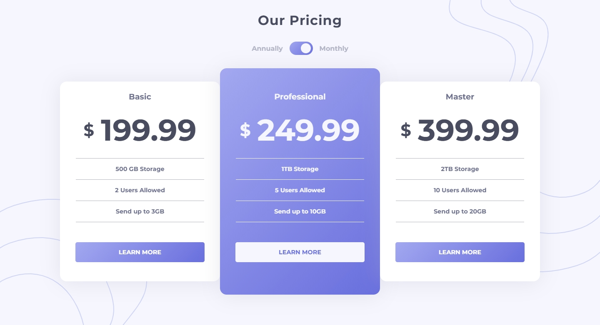
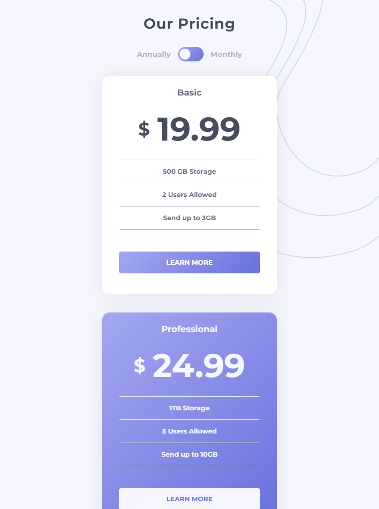
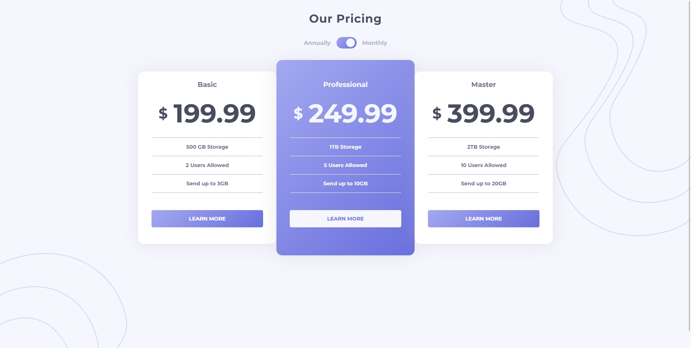

# Frontend Mentor - File Transfer pricing component

## The challenge 

The challenge was to build out the pricing component design and get it looking as close to the design as possible.

Your users should be able to:

- View the optimal layout for the component depending on their device's screen size
- Control the toggle with both their mouse/trackpad and their keyboard
- **Bonus**: Complete the challenge with just HTML and CSS

Below are my designs:

### 1. Macbook Air (1440 x 900)

### 2. iPad Pro 11 (834 x 1194) 

### 3. Desktop (1920 x 1080)

**Have fun Using this!** 🚀